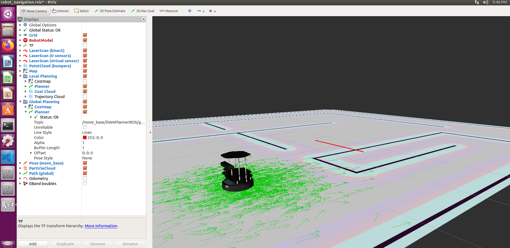
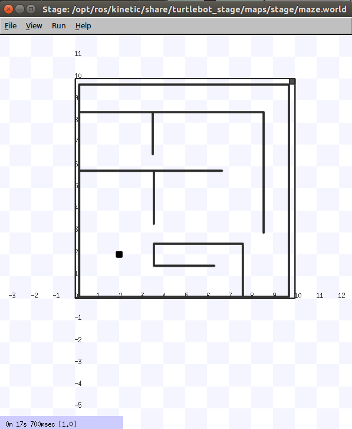

# BZU Workshop - Spring 2023

<p align="center">
<picture>
  
</picture>
</p>


## ROS Example 3: TurtleBot Simulation using RViz

In this example, we'll work on 3D simulation for TurtleBot 2 using RViz in ROS.

### Movement Code

In this file (`ros\ros_demo\src\turtlebot_sim\turtlebot_qazdoora.py`), you'll find a code that rotates and moves the TurtleBot robot.

We'll apply it on a virtual TurtleBot robot in a 3D simulation environment.

Add the movement Python file in your package (`turtlebot_sim` directory in our case).

------------

### Install TurtleBot Packages for RViz

```sh
sudo apt-get install ros-kinetic-turtlebot-*
```

------------

### Launch TurtleBot in RViz

```sh
roslaunch turtlebot_stage turtlebot_in_stage.launch
```

After running this command, RViz simulation will start with TurtleBot robot.

<p align="center">
<picture>
  
</picture>
</p>

In case of `TURTLEBOT_STAGE_MAP_FILE` error, try to use these commands in terminal:

```sh
export TURTLEBOT_STAGE_WORLD_FILE="/opt/ros/kinetic/share/turtlebot_stage/maps/stage/maze.world"

export TURTLEBOT_STAGE_MAP_FILE="/opt/ros/kinetic/share/turtlebot_stage/maps/maze.yaml"
```

Also, after running the same command; you can see the 2D stage for TurtleBot robot:

<p align="center">
<picture>
  
</picture>
</p>

------------


### Exercise

Try to apply the movement code on TurtleBot in RViz environemt


</br>

_Purpose Team_

