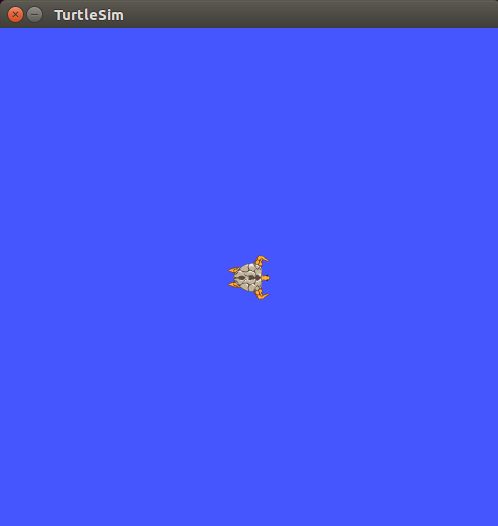
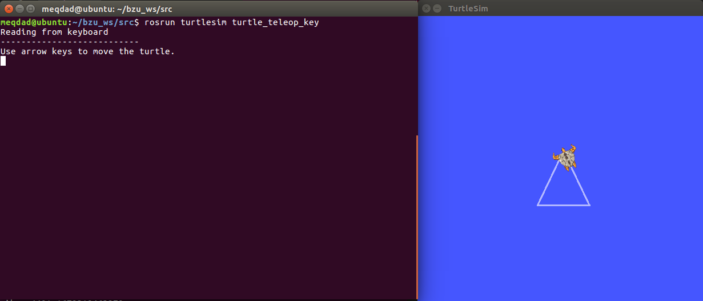

# BZU Workshop - Spring 2023

<p align="center">
<picture>
  
</picture>
</p>

## ROS Example 2: TurtleSim Example

The following example is to work with `turtlesim node` which is attached in ROS packages.

### Compile packages

```sh
catkin_make
```

Run the ROS master node:

```sh
roscore
```

------------

### Run the `turtlesim_node`

```sh
rosrun turtlesim turtlesim_node
```

After running this command, you'll see a graphical representation for turtle.

<p align="center">
<picture>
  
</picture>
</p>

You'll notice that you can't control turtle movement.

------------

### Run the `turtle_teleop_key`

There is a built-in feature `turtle_teleop_key` that takes the keyboard input from the user and convert it to ROS msg that controls the turtle position:

```sh
rosrun turtlesim turtle_teleop_key
```

Now, you can control the turtle's position from your keyboard.

Take a look on the image below for drawing triangle using the turtle.

<p align="center">
<picture>
  
</picture>
</p>

### Exercise

Try to figure out the purpose of this command:

```sh
rostopic echo /turtle1/cmd_vel
```

</br>


_Purpose Team_
